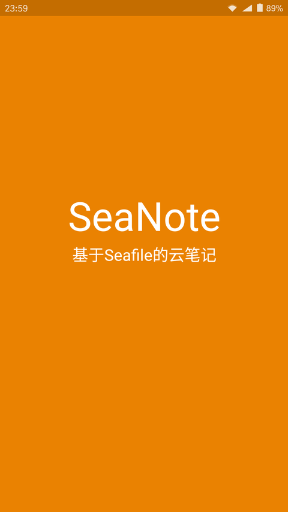
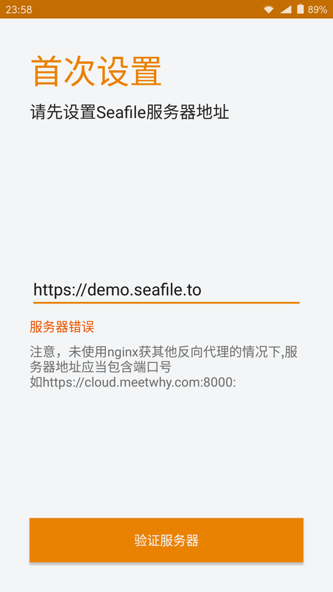
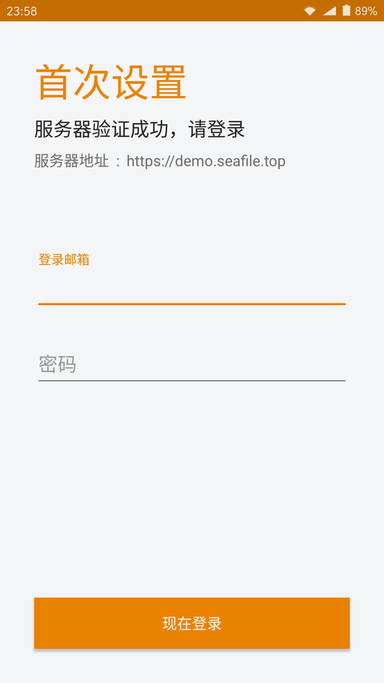
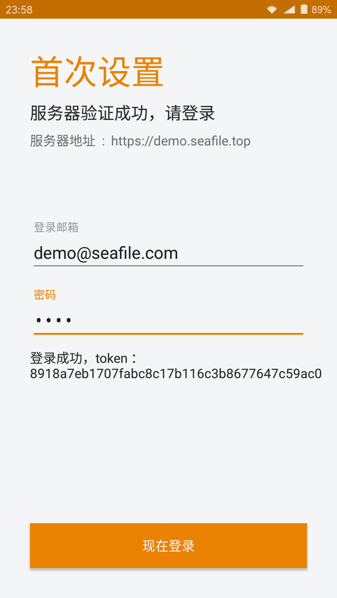
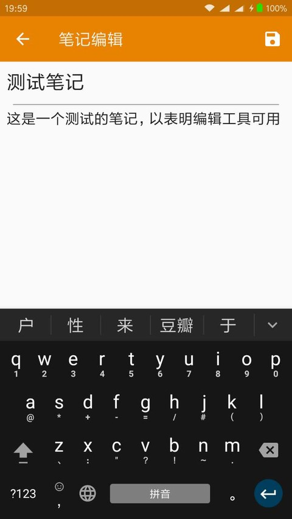
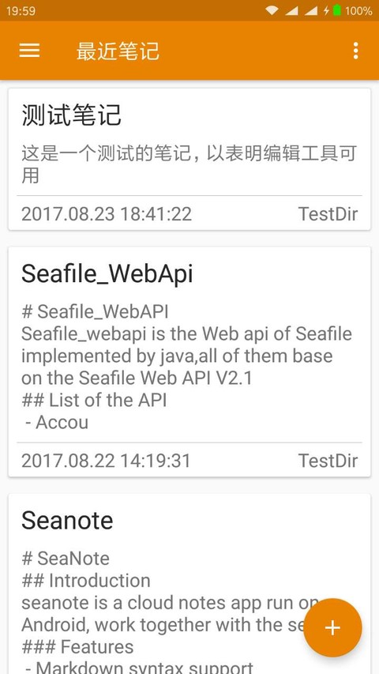
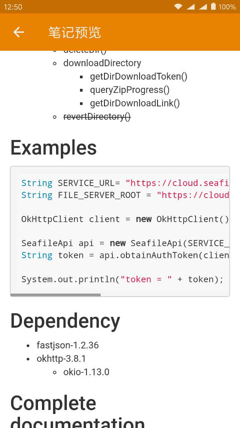

# SeaNote

## Introduction
seanote is a cloud notes app run on Android, work together with the seafile.

### Features
 - Markdown syntax support
 - Store the `.md` file in your device and your private seafile library
 - Incorporates the material design interface, and a markdown editor

### The current progress of the development
 - 2017.08.18
    - Finish the initial setup activity, and the checkout of server and account.
 - 2017.08.19
    - Successed in creating the seanote's library and getting repo_id for the further development
 - 2017.08.21
    - Finish the preview Activity
 - 2017.08.23
    - Fix the Preview of MarkDown File
    - Add the EditActivity
    - Finish the local note file save function
 - some screenshots about the current development 
    - 
    - 
    - 
    - 
    - 
    - 
    - 

## Dependency
 - [Seafile_WebApi](https://github.com/Ericwyn/Seafile_WebApi)
 - [BaseRecyclerViewAdapterHelper-2.9.27](https://github.com/CymChad/BaseRecyclerViewAdapterHelper)
 - [HeiPermission](https://github.com/forJrking/HeiPermission)
 - fastjson-1.2.36